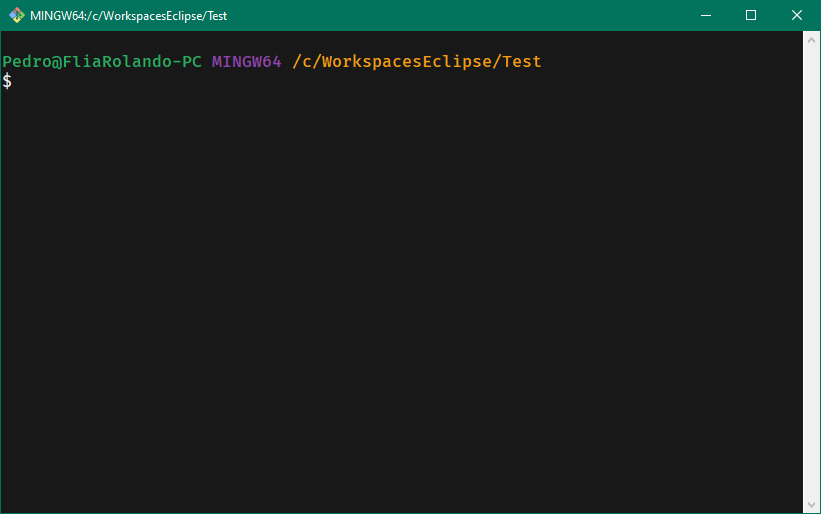

# TP01 - Turismo en la Tierra Media

[Consigna](_consigna%2FTP001%20-%20Turismo%20en%20la%20Tierra%20Media%2C%20Cap%C3%ADtulo%20I.pdf)

## Cómo clonar este repositorio

Lo primero es obtener la URL del repositorio

### Clonar con GitBash

Abrir GitBash e ir a la ubicación de nuestro workspace de Eclipse.

Ejecutar el comando `git clone <url_repositorio>`

Repositorio clonado

Abrir e importar el proyecto en Eclipse

Seleccionar la opción 'General/Existing Projects into Workspace' y presionar Next

Presionar el boton Browse 

Seleccionar la carpeta del proyecto

Dar clic en Finish

### Clonar con Eclipse

Abrir Eclipse e ir al menu File/Import

Seleccionar la opción 'Git/Projects from Git' y presionar Next

Seleccionar la opción 'Clone URI' y presionar Next

En el campo URI pegar la URL del repo

Completar los datos de Authentication y presionar Next

Dejar todo como esta y darle a Next

Presionar el boton browse y seleccionar la ubicación de nuestro workspace de Eclipse

Dejar todo como esta y darle a Next

Dar clic en Finish

